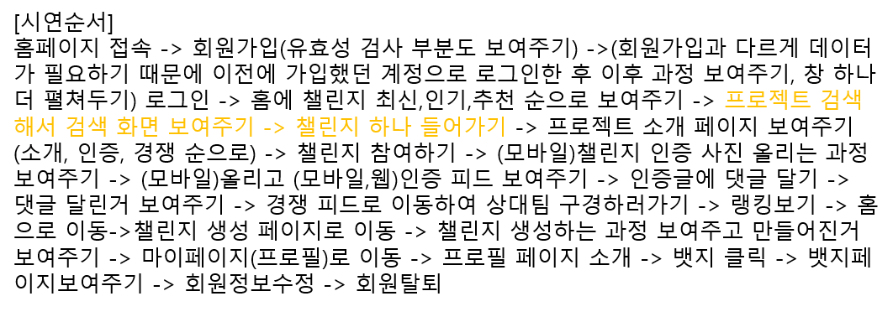

## setting script

```node
node{
    stage('clear'){
        sh(script:'rm -rf *')
        sh(script:'rm -rf .git')
        sh(script:'rm -rf .nginx')
        sh(script:'docker')
    }
    
    stage('clone'){
        sh(script: 'git clone https://h00335:~~~~~/s05-webmobile2-sub3/S05P13B102.git .')
    }
    
    stage('unit test'){
        
    }
    
    stage('build'){
        // sh(script: 'docker-compose up -d')
    }
    
    stage('Tag'){
        
    }
    
    stage('Push'){
        
    }
    
    stage('Deploy'){
        sh(script: 'docker-compose up -d --build')
    }
}
```

